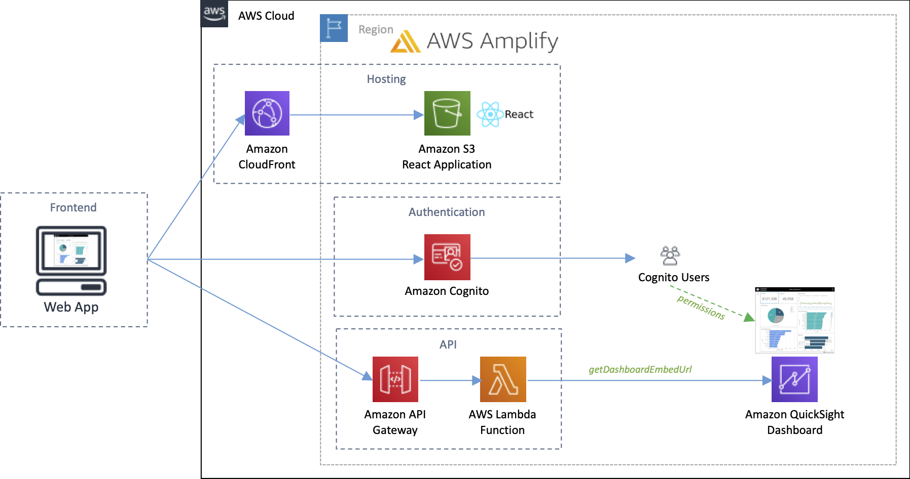
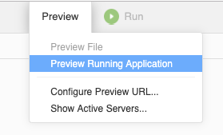
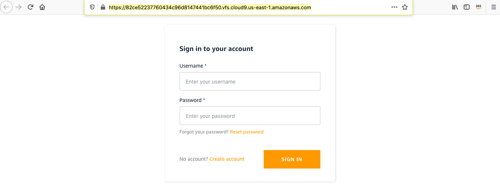
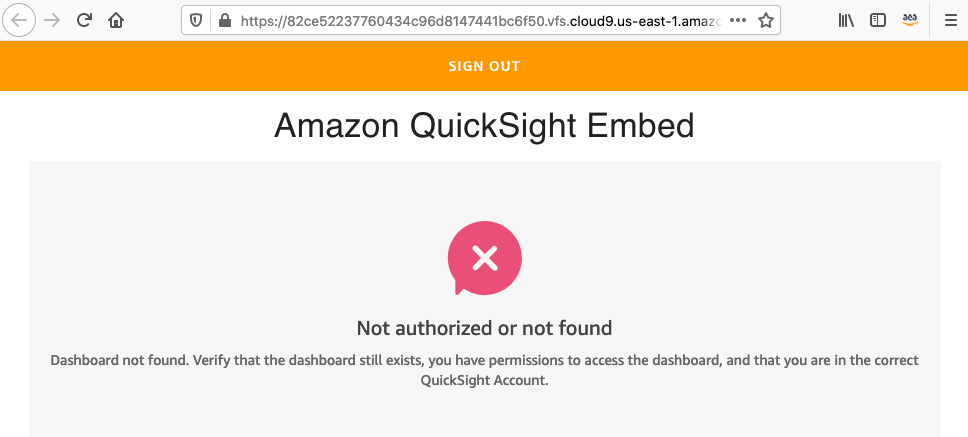
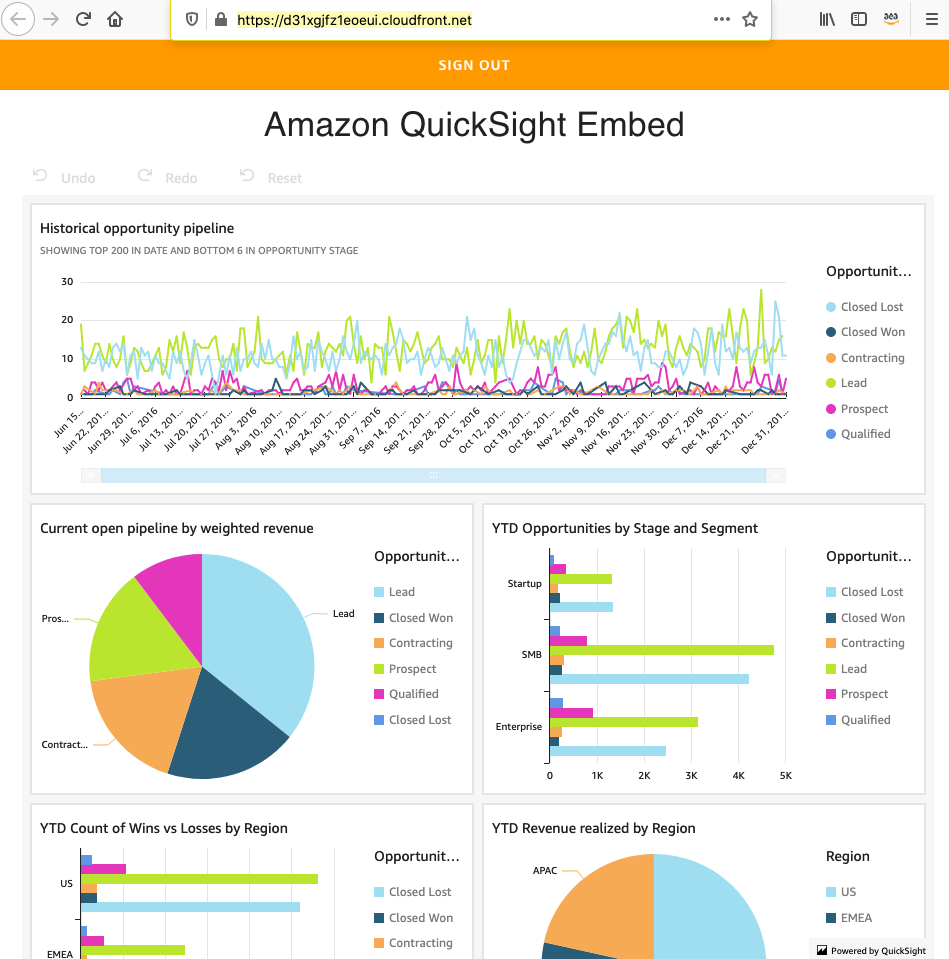

# Embedding Amazon QuickSight Dashboards in a React Application using Amplify




## Requirements

* Work inside your [AWS Cloud9](https://aws.amazon.com/cloud9/) or local environment with AWS CLI configured.
* [AWS Account with Quicksight Enterprise Edition](https://aws.amazon.com/premiumsupport/knowledge-center/quicksight-enterprise-account/).
* [QuickSight Dashboard created](https://docs.aws.amazon.com/quicksight/latest/user/example-analysis.html).


## Configure your Cloud9 environment

Inside the Cloud9 environment, in the bash terminal we are going to configure the AWS CLI with your IAM credentials as follows.

``` bash
aws configure
```

- In AWS Cloud9 configure the AWS CLI as follows. 
    - AWS Access Key ID: ** (Type your Access key ID)**
    - AWS Secret Access Key: **(Type your Secret access key)**
    - Default region name [us-east-1]: **us-east-1**
    - Default output format [json]: **json**

Remove aws_session_token variable from aws credentials.

``` bash
sed -i 's/aws_session_token =//g' ~/.aws/credentials
```


## Install dependencies and create the React project

Install Amplify CLI tool https://github.com/aws-amplify/amplify-cli

``` bash
npm install -g @aws-amplify/cli
```

Create the React project.

``` bash
npx create-react-app amplify-quicksight-dashboard-embedded
cd amplify-quicksight-dashboard-embedded
npm install amazon-quicksight-embedding-sdk
npm install aws-amplify aws-amplify-react @aws-amplify/ui-react @material-ui/core
```


## Initialize your project with Amplify

``` bash
amplify init
```

? Enter a name for the project **amplifyquicksightdas**

? Enter a name for the environment **dev**

? Choose your default editor: **Sublime Text**

? Choose the type of app that you're building **javascript**

Please tell us about your project

? What javascript framework are you using **react**

? Source Directory Path:  **src**

? Distribution Directory Path: **build**

? Build Command:  **npm run-script build**

? Start Command: **npm run-script start**

Using default provider  awscloudformation

For more information on AWS Profiles, see:

https://docs.aws.amazon.com/cli/latest/userguide/cli-multiple-profiles.html

? Do you want to use an AWS profile? **Yes**

? Please choose the profile you want to use **default**


## Authentication with Amazon Cognito

Add authentication with the following command using the default values.

``` bash
amplify auth add
```
? Do you want to use the default authentication and security configuration? **Default configuration**

 Warning: you will not be able to edit these selections. 

? How do you want users to be able to sign in? **Username**

? Do you want to configure advanced settings? **No, I am done.**


## Add Lambda Function

``` bash
amplify add function
```

? Select which capability you want to add: **Lambda function (serverless function)**

? Provide a friendly name for your resource to be used as a label for this category in the project: **getQuickSightDashboardEmbedURL**

? Provide the AWS Lambda function name: **getQuickSightDashboardEmbedURL**

? Choose the runtime that you want to use: **NodeJS**

? Choose the function template that you want to use: **Serverless ExpressJS function (Integration with API Gateway)**

? Do you want to access other resources in this project from your Lambda function? **No**

? Do you want to invoke this function on a recurring schedule? **No**

? Do you want to configure Lambda layers for this function? **No**

? Do you want to edit the local lambda function now? **No**


## Add API  REST

``` bash
amplify add api
```

? Please select from one of the below mentioned services: **REST**

? Provide a friendly name for your resource to be used as a label for this category in the project: **quicksight**

? Provide a path (e.g., /book/{isbn}): **/getQuickSightDashboardEmbedURL**

? Choose a Lambda source **Use a Lambda function already added in the current Amplify project**

? Choose the Lambda function to invoke by this path **getQuickSightDashboardEmbedURL**

? Restrict API access **Yes**

? Who should have access? **Authenticated users only**

? What kind of access do you want for Authenticated users? **read**

? Do you want to add another path? **No**


Build all your local backend resources and provision it in the cloud with the following command.

``` bash
amplify push
```


## Configure the React application

For the file **src/App.js**, replace the content with the following lines.

``` javascript
import Typography from '@material-ui/core/Typography';
import Container from '@material-ui/core/Container';
import Amplify, { Auth } from 'aws-amplify';
import { withAuthenticator, AmplifySignOut } from '@aws-amplify/ui-react';
import awsconfig from './aws-exports';
import Embed from './Embed';
import { makeStyles } from '@material-ui/core/styles';

Amplify.configure(awsconfig);

const useStyles = makeStyles((theme) => ({
  title: {
    paddingTop: theme.spacing(2)
  },
}));

function App() {
  
  const classes = useStyles();
  
  return (
    <div>
      <AmplifySignOut />
      <Container maxWidth="md">
        <Typography variant="h4" component="h1" align="center" color="textPrimary" className={classes.title} gutterBottom>
          Amazon QuickSight Embed
        </Typography>
        <Embed />
      </Container>
    </div>
  );
}

export default withAuthenticator(App);

```

Create the file **src/Embed.js** and add the following lines.

``` javascript
import React from 'react';
import { API, Auth } from 'aws-amplify';
import CircularProgress from '@material-ui/core/CircularProgress';
import { withStyles } from '@material-ui/core/styles';

var QuickSightEmbedding = require("amazon-quicksight-embedding-sdk");

const useStyles = theme => ({
  loading: {
    alignContent: 'center',
    justifyContent: 'center',
    display: 'flex',
    marginTop: theme.spacing(4),
  },
});

class Embed extends React.Component {

    constructor(props){
        super(props);
        this.state = {
            loader: true
        };
    }
    
    componentDidMount() {
        this.getQuickSightDashboardEmbedURL();
    }
    
    getQuickSightDashboardEmbedURL = async () => {
        const data = await Auth.currentSession();
        const jwtToken = data.idToken.jwtToken;
        const payloadSub = data.idToken.payload.sub;
        const email = data.idToken.payload.email;
        
        const params = { 
            headers: {},
            response: true,
            queryStringParameters: {
                jwtToken: jwtToken,
                payloadSub: payloadSub,
                email: email
            }
        }
        const quicksight = await API.get('quicksight', '/getQuickSightDashboardEmbedURL', params);
        console.log(quicksight);
        const containerDiv = document.getElementById("dashboardContainer");
        
        const options = {
            url: quicksight.data.data.EmbedUrl,
            container: containerDiv,
            parameters: {
                country: "United States"
            },
            scrolling: "no",
            height: "800px",
            width: "912px",
            footerPaddingEnabled: true,
        };
        const dashboard = QuickSightEmbedding.embedDashboard(options);
        this.setState({ loader: false });
    };
    
    render() {
        const { classes } = this.props;
        return (
            <div>
                { this.state.loader && (
                    <div className={classes.loading}> <CircularProgress /> </div>
                )}
                <div id="dashboardContainer"></div>
            </div>
        );
    }
}

export default withStyles(useStyles)(Embed);
```

## Update your Lambda function and permissions required

In the file [**amplify/backend/function/getQuickSightDashboardEmbedURL/getQuickSightDashboardEmbedURL-cloudformation-template.json**](amplify/backend/function/getQuickSightDashboardEmbedURL/getQuickSightDashboardEmbedURL-cloudformation-template.json) add the following lines to the **lambdaexecutionpolicy** resource in the **PolicyDocument** property (line 130).

``` json
						{
							"Effect": "Allow",
							"Action": [
								"sts:AssumeRoleWithWebIdentity"
							],
							"Resource": "*"
						},
						{
							"Effect": "Allow",
							"Action": [
							    "cognito-identity:GetId",
							    "cognito-identity:GetOpenIdToken"
							],
							"Resource": "*"
						},
```

Install the dependencie **amazon-cognito-identity-js** for your backend function **getQuickSightDashboardEmbedURL**.

``` bash
cd amplify/backend/function/getQuickSightDashboardEmbedURL/src/
npm install amazon-cognito-identity-js
cd ../../../../../
```

For the file **amplify/backend/function/getQuickSightDashboardEmbedURL/src/app.js** replace the content with the following lines.

Inside the code replace the following values with your own values that can be found in your CloudFormation stack outputs:

* `<cognito-authenticated-role-arn>`
* `<identity-pool-id>`
* `<user-pool-id>`
* `<account-id>`
* `<dashboard-id>`

``` javascript
var express = require('express')
var bodyParser = require('body-parser')
var awsServerlessExpressMiddleware = require('aws-serverless-express/middleware')

var AWS = require('aws-sdk');
var AmazonCognitoIdentity = require('amazon-cognito-identity-js');
const https = require('https');

// declare a new express app
var app = express()
app.use(bodyParser.json())
app.use(awsServerlessExpressMiddleware.eventContext())

// Enable CORS for all methods
app.use(function(req, res, next) {
  res.header("Access-Control-Allow-Origin", "*")
  res.header("Access-Control-Allow-Headers", "Origin, X-Requested-With, Content-Type, Accept")
  next()
});

/**********************
 * getQuickSightDashboardEmbedURL get method *
 **********************/

app.get('/getQuickSightDashboardEmbedURL', function(req, res) {

    var roleArn = '<cognito-authenticated-role-arn>'; // your cognito authenticated role arn here
  
    AWS.config.region = 'us-east-1';
  
    var sessionName = req.query.payloadSub;
    var cognitoIdentity = new AWS.CognitoIdentity();
    var stsClient = new AWS.STS();
    var params = {
        IdentityPoolId: '<identity-pool-id>', // your identity pool id here
        Logins: {
            // your logins here
            'cognito-idp.us-east-1.amazonaws.com/<user-pool-id>': req.query.jwtToken
        }
    };
    
    cognitoIdentity.getId(params, function(err, data) {
        if (err) console.log(err, err.stack);
        else {
            data.Logins = {
                // your logins here
                'cognito-idp.us-east-1.amazonaws.com/<user-pool-id>': req.query.jwtToken
            };

            cognitoIdentity.getOpenIdToken(data, function(err, openIdToken) {
                if (err) {
                    console.log(err, err.stack);
                    //callback(err);
                    res.json({
                      err
                    })
                } else {
                    let stsParams = {
                        RoleSessionName: sessionName,
                        WebIdentityToken: openIdToken.Token,
                        RoleArn: roleArn
                    }
                    stsClient.assumeRoleWithWebIdentity(stsParams, function(err, data) {
                        if (err) {
                            console.log(err, err.stack);
                            //callback(err);
                            res.json({
                              err
                            })
                        } else {
                            AWS.config.update({
                                region: 'us-east-1',
                                credentials: {
                                    accessKeyId: data.Credentials.AccessKeyId,
                                    secretAccessKey: data.Credentials.SecretAccessKey,
                                    sessionToken: data.Credentials.SessionToken,
                                    expiration: data.Credentials.Expiration
                                }
                            });
                            var registerUserParams = {
                                // required
                                AwsAccountId: "<account-id>",
                                // can be passed in from api-gateway call
                                Email: req.query.email,
                                // can be passed in from api-gateway call
                                IdentityType: 'IAM',
                                // can be passed in from api-gateway call
                                Namespace: 'default',
                                // can be passed in from api-gateway call
                                UserRole: 'READER',
                                IamArn: roleArn,
                                SessionName: sessionName
                            };
                            var quicksight = new AWS.QuickSight();
                            quicksight.registerUser(registerUserParams, function(err, data) {
                                if (err) {
                                    console.log("3");
                                    console.log(err, err.stack); // an error occurred
                                    if (err.code && err.code === 'ResourceExistsException') {
                                      var getDashboardParams = {
                                            // required
                                            AwsAccountId: "<account-id>",
                                            // required
                                            DashboardId: "<dashboard-id>",
                                            // required
                                            IdentityType: 'IAM',
                                            ResetDisabled: false, // can be passed in from api-gateway call
                                            SessionLifetimeInMinutes: 100, // can be passed in from api-gateway call
                                            UndoRedoDisabled: false // can be passed in from api-gateway call
                                        };
                                        var quicksightGetDashboard = new AWS.QuickSight();
                                        quicksightGetDashboard.getDashboardEmbedUrl(getDashboardParams, function(err, data) {
                                            if (err) {
                                                console.log(err, err.stack); // an error occurred
                                                  res.json({
                                                    err
                                                  })
                                            } else {
                                                console.log(data);
                                                res.json({
                                                  data
                                                })
                                            }
                                        });
                                    } else {
                                      res.json({
                                        err
                                      })
                                    }
                                } else {
                                    // successful response
                                    setTimeout(function() {
                                    var getDashboardParams = {
                                          // required
                                          AwsAccountId: "<account-id>",
                                          // required
                                          DashboardId: "<dashboard-id>",
                                          // required
                                          IdentityType: 'IAM',
                                          ResetDisabled: false, // can be passed in from api-gateway call
                                          SessionLifetimeInMinutes: 100, // can be passed in from api-gateway call
                                          UndoRedoDisabled: false // can be passed in from api-gateway call
                                      };
                                  
                                      var quicksightGetDashboard = new AWS.QuickSight();
                                      quicksightGetDashboard.getDashboardEmbedUrl(getDashboardParams, function(err, data) {
                                          if (err) {
                                              console.log(err, err.stack); // an error occurred
                                                res.json({
                                                  err
                                                })
                                          } else {
                                              console.log(data);
                                              res.json({
                                                data
                                              })
                                          }
                                      });
                                        
                                    }, 2000);
                                    
                                }
                            });
                            
                        }
                    });
                }
            });
        }
    });

});

app.listen(3000, function() {
    console.log("App started")
});

module.exports = app
```

Identify your **AuthRole** assigned to your Cognito Identity Pool and add the following inline policy.

``` json
{
    "Version": "2012-10-17",
    "Statement": [
        {
            "Action": "quicksight:RegisterUser",
            "Resource": "*",
            "Effect": "Allow"
        },
        {
            "Action": "quicksight:GetDashboardEmbedUrl",
            "Resource": "*",
            "Effect": "Allow"
        }
    ]
}
```

Update your lambda function and permissions in the cloud with the following command.

``` bash
amplify push
```


## Testing your Application inside Cloud9

Inside your amplify project start the React application.

``` bash
npm start
```

Use the **Preview Running Application** option inside the Cloud9 environment.



Create a new new account following the proccess and login.



Cloud9 expose a **HTTPS URL**, copy the URL provided and in **Manage QuickSight** add the domain in **Domains and Embedding** section.

https://docs.aws.amazon.com/quicksight/latest/user/approve-domain-for-dashboard-embedding.html

Now you can test your application and see the dashboard with the following message **"Not authorized or not found"**.



Update the dashboard permissions, you will find a new user added to Quicksight related to Cognito, just add the user to the Dashboard and show the dashboard again.

Managed dashboard permissions for sharing: https://docs.aws.amazon.com/quicksight/latest/user/sharing-a-dashboard.html#share-a-dashboard


## Hosting with Amazon S3 and Amazon CloudFront (Optional)

``` bash
amplify add hosting
```

? Select the plugin module to execute **Amazon CloudFront and S3**

? Select the environment setup: **PROD (S3 with CloudFront using HTTPS)**

? hosting bucket name **(use default name or personalized)**


``` bash
amplify publish
```

Add the **Hosting endpoint** to your [domains in QuickSight](https://docs.aws.amazon.com/quicksight/latest/user/approve-domain-for-dashboard-embedding.html).

Use the **Hosting endpoint** to browse inside your React application to visualize your dashboard.

